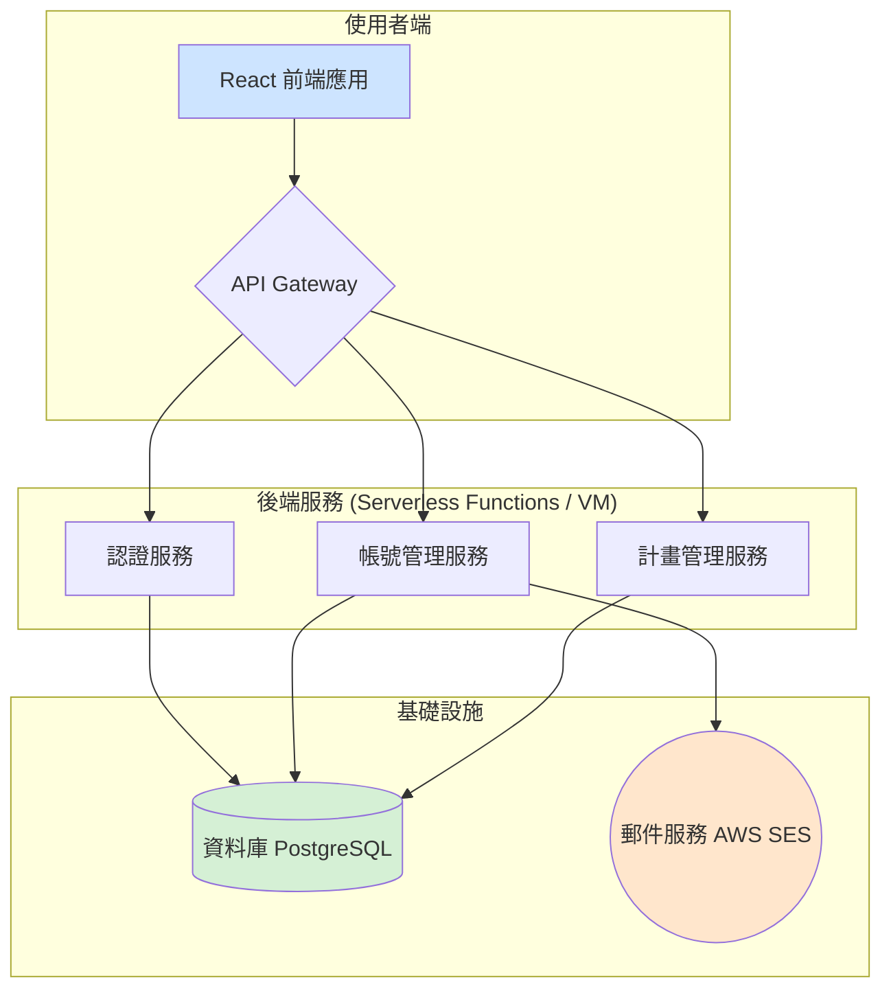
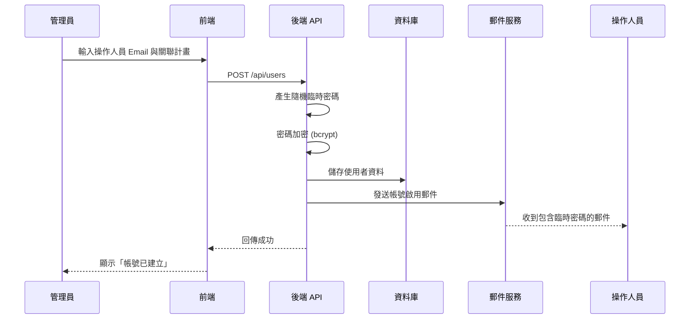
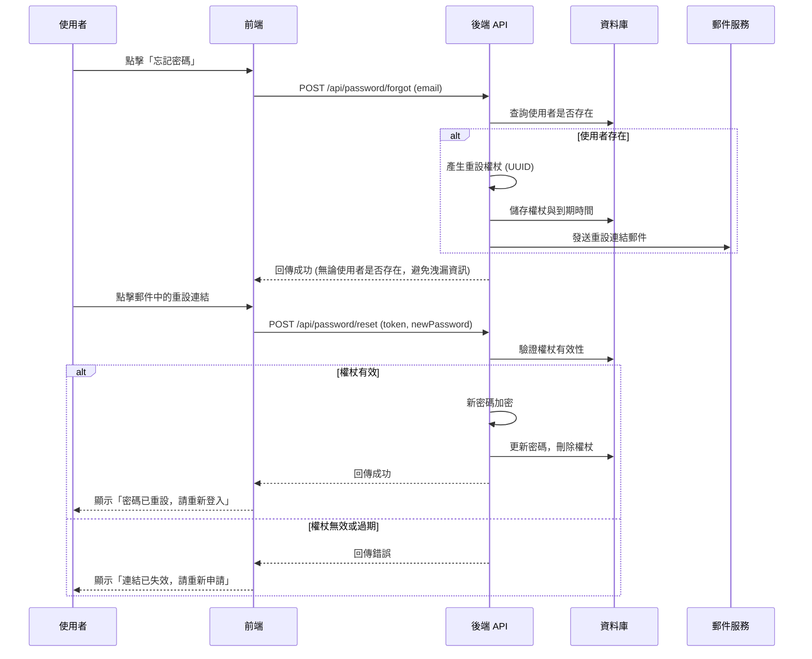

# 文化部原村管考系統 - 後端技術架構規劃

## 1. 系統目標

本文件旨在規劃「文化部原村管考系統」的後端服務，以支援使用者帳號管理、認證授權、自動化郵件通知以及訪視紀錄的資料自動帶入等核心功能。目標是建立一個安全、可擴展且易於維護的後端系統，與現有的 React 前端應用程式無縫整合。

## 2. 核心功能需求

根據使用者需求，後端系統需實現以下功能：

- **管理員建立帳號**：管理員在系統中為特定計畫建立操作人員帳號。
- **自動產生密碼與郵件通知**：帳號建立後，系統自動產生一組臨時密碼，並透過電子郵件發送給操作人員。
- **使用者登入與密碼變更**：操作人員首次登入後，應被引導修改密碼。使用者也能隨時變更自己的密碼。
- **忘記密碼功能**：提供「忘記密碼」流程，讓使用者能透過電子郵件重設密碼。
- **權限控管**：根據使用者角色（管理員、操作人員）控制對不同 API 端點的存取權限。
- **訪視紀錄表自動化**：在填寫「輔導老師訪視紀錄表」時，系統能自動帶入計畫的實施地點、輔導老師姓名、計畫期程及 OKR 目標，減少手動輸入。

## 3. 技術選型

為了快速開發與部署，我們建議採用以下技術棧：

| 組件 | 技術 | 選擇原因 |
|---|---|---|
| **執行環境** | Node.js | JavaScript 生態系完整，與前端 React 技術棧一致，降低開發複雜度。 |
| **後端框架** | Express.js 或 NestJS | Express.js 輕量且靈活；NestJS 提供更完整的架構（基於 TypeScript），適合大型專案。可依據未來複雜度選擇。 |
| **資料庫** | PostgreSQL | 功能強大的開源關聯式資料庫，支援複雜查詢與事務，穩定性高。 |
| **ORM** | Drizzle ORM 或 Prisma | 提供型別安全的資料庫操作，簡化開發流程，與 TypeScript 完美整合。 |
| **認證機制** | JWT (JSON Web Tokens) | 無狀態認證，易於水平擴展，適合 SPA (單頁應用程式) 架構。 |
| **郵件服務** | AWS SES / SendGrid / Mailgun | 專業的第三方郵件發送服務，確保郵件送達率，避免被歸類為垃圾郵件。 |
| **部署平台** | Vercel / AWS / Google Cloud | Vercel 支援 Serverless Functions，可與前端專案一同部署，簡化流程。AWS/GCP 提供更完整的雲端服務。 |

## 4. 系統架構圖

以下為系統高階架構圖，展示各組件之間的互動關係。



**流程說明：**
1.  **使用者請求**：前端應用程式向 API Gateway 發送請求。
2.  **路由與認證**：API Gateway 將請求路由至對應的後端服務。對於需要認證的請求，會先由「認證服務」驗證 JWT。
3.  **業務邏輯處理**：各服務（帳號管理、計畫管理）執行相應的業務邏輯，並與資料庫進行互動。
4.  **郵件觸發**：當需要發送郵件時（如建立帳號、重設密碼），「帳號管理服務」會呼叫「郵件服務」。
5.  **回應**：後端服務將處理結果回傳給前端應用程式。

## 5. 資料庫結構 (Schema)

以下為建議的資料庫核心資料表結構。

### `users` (使用者資料表)

儲存使用者基本資料、角色與密碼。

| 欄位 | 型別 | 描述 |
|---|---|---|
| `id` | UUID | 主鍵，唯一識別碼 |
| `name` | VARCHAR(255) | 使用者姓名（例如：輔導老師姓名） |
| `email` | VARCHAR(255) | 使用者信箱，具唯一性，用於登入 |
| `password_hash` | VARCHAR(255) | 加密後的密碼雜湊值 |
| `role` | ENUM('ADMIN', 'OPERATOR', 'MENTOR') | 使用者角色（管理員、操作人員、輔導老師） |
| `unit_id` | VARCHAR(255) | 所屬單位 ID，用於關聯計畫 |
| `created_at` | TIMESTAMPTZ | 建立時間 |
| `updated_at` | TIMESTAMPTZ | 最後更新時間 |

### `projects` (計畫資料表)

儲存計畫基本資料。

| 欄位 | 型別 | 描述 |
|---|---|---|
| `id` | UUID | 主鍵，唯一識別碼 |
| `project_code` | VARCHAR(255) | 計畫編號，具唯一性 |
| `name` | VARCHAR(255) | 計畫名稱 |
| `unit_id` | VARCHAR(255) | 執行單位 ID，用於關聯使用者 |
| `mentor_id` | UUID | 輔導老師 ID，關聯至 `users` 資料表 |
| `implementation_location` | VARCHAR(255) | 計畫實施地點 |
| `start_date` | DATE | 計畫開始日期 |
| `end_date` | DATE | 計畫結束日期 |
| `okr_summary` | TEXT | 計畫 OKR 簡表或目標 |
| `...` | ... | 其他計畫相關欄位 |

### `password_resets` (密碼重設記錄表)

儲存密碼重設請求的臨時權杖。

| 欄位 | 型別 | 描述 |
|---|---|---|
| `id` | UUID | 主鍵 |
| `user_id` | UUID | 關聯至 `users` 資料表 |
| `token` | VARCHAR(255) | 一次性的重設權杖，具唯一性 |
| `expires_at` | TIMESTAMPTZ | 權杖到期時間 |

## 6. API 端點規格

以下為核心功能的 API 端點設計。

### Authentication (認證)

- **`POST /api/auth/login`**
  - **功能**: 使用者登入。
  - **請求**: `{ "email": "user@example.com", "password": "your_password" }`
  - **回應**: `{ "accessToken": "jwt_token..." }`

### Project Management (計畫管理)

- **`GET /api/projects/{id}/visit-details`**
  - **功能**: 取得特定計畫的訪視紀錄所需資料。
  - **回應**: 
    ```json
    {
      "implementationLocation": "計畫資料的實施地點",
      "mentorName": "輔導老師姓名",
      "projectSchedule": "2025-12-26至2026-12-05",
      "okrSummary": "計畫資料中的OKR目標"
    }
    ```

### User Management (使用者管理 - 僅限管理員)

- **`POST /api/users`**
  - **功能**: 建立新的操作人員帳號。
  - **請求**: `{ "email": "operator@example.com", "projectId": "project_uuid" }`
  - **動作**: 建立使用者，產生臨時密碼，並寄送啟用郵件。
  - **回應**: `201 Created`

- **`GET /api/users`**
  - **功能**: 取得所有使用者列表。
  - **回應**: `[{ "id": "...", "email": "...", "role": "..." }]`

### Account (個人帳號)

- **`PUT /api/account/password`**
  - **功能**: 已登入使用者變更密碼。
  - **請求**: `{ "currentPassword": "...", "newPassword": "..." }`
  - **回應**: `200 OK`

### Password Reset (忘記密碼)

- **`POST /api/password/forgot`**
  - **功能**: 請求密碼重設。
  - **請求**: `{ "email": "user@example.com" }`
  - **動作**: 產生重設權杖，並寄送包含重設連結的郵件。
  - **回應**: `200 OK`

- **`POST /api/password/reset`**
  - **功能**: 使用權杖重設密碼。
  - **請求**: `{ "token": "reset_token...", "newPassword": "..." }`
  - **回應**: `200 OK`


## 7. 核心流程圖

### 7.1 管理員建立帳號流程



### 7.2 忘記密碼流程



## 8. 安全性考量

在設計後端系統時，安全性是首要考量。以下為關鍵的安全措施：

| 項目 | 措施 | 說明 |
|---|---|---|
| **密碼儲存** | bcrypt 雜湊 | 使用 bcrypt 演算法對密碼進行單向雜湊，即使資料庫洩漏，攻擊者也無法還原原始密碼。 |
| **傳輸安全** | HTTPS | 所有 API 請求必須透過 HTTPS 加密傳輸，防止中間人攻擊。 |
| **JWT 安全** | 短效期 + Refresh Token | Access Token 設定較短的有效期（如 15 分鐘），搭配 Refresh Token 機制延長使用者登入狀態。 |
| **防暴力破解** | Rate Limiting | 對登入、忘記密碼等敏感端點實施請求頻率限制，防止暴力破解攻擊。 |
| **輸入驗證** | 伺服器端驗證 | 所有輸入資料必須在伺服器端進行驗證與清理，防止 SQL Injection、XSS 等攻擊。 |
| **權限控管** | RBAC (基於角色的存取控制) | 根據使用者角色嚴格控制 API 端點的存取權限，確保操作人員無法存取管理員功能。 |

## 9. 實作建議與時程估算

### 9.1 建議實作方式

考量到現有專案已部署於 Vercel，建議採用 **Vercel Serverless Functions** 搭配 **PostgreSQL (如 Neon 或 Supabase)** 的方式實作後端。這種方式的優點是：

1.  **部署簡便**：後端程式碼可與前端專案放在同一個 Repository，透過 Vercel 一鍵部署。
2.  **成本效益**：Serverless 架構按需計費，對於使用量不大的管考系統而言，成本較低。
3.  **維護簡單**：無需管理伺服器，降低維運負擔。

### 9.2 時程估算

| 階段 | 工作項目 | 預估時間 |
|---|---|---|
| **第一階段** | 環境建置、資料庫設計與建立 | 2-3 天 |
| **第二階段** | 認證 API (登入、JWT) | 2-3 天 |
| **第三階段** | 帳號管理 API (建立帳號、密碼變更) | 2-3 天 |
| **第四階段** | 忘記密碼 API + 郵件整合 | 2-3 天 |
| **第五階段** | 前端整合與測試 | 3-5 天 |
| **總計** | | **約 2-3 週** |

## 10. 下一步行動

1.  **確認技術選型**：與團隊確認是否採用建議的技術棧。
2.  **選擇郵件服務**：評估 AWS SES、SendGrid、Mailgun 等服務的價格與功能。
3.  **選擇資料庫服務**：評估 Neon、Supabase、PlanetScale 等 Serverless PostgreSQL/MySQL 服務。
4.  **開始實作**：依據本文件的設計開始開發後端 API。

---

*文件版本：1.1*
*修改日期：2026 年 2 月 7 日*
*作者：Manus AI*
